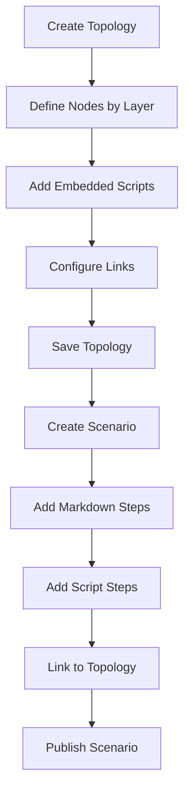
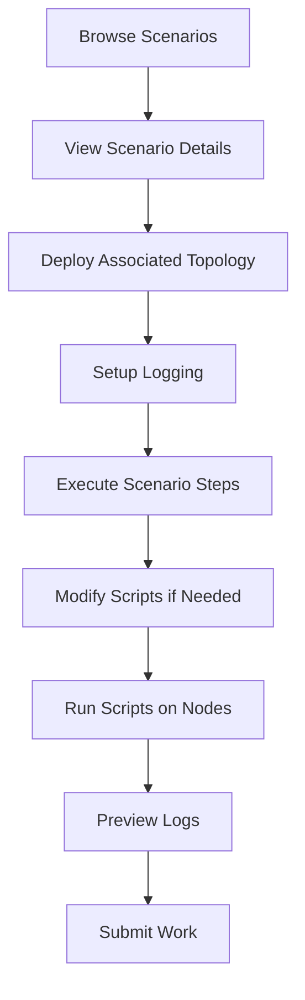
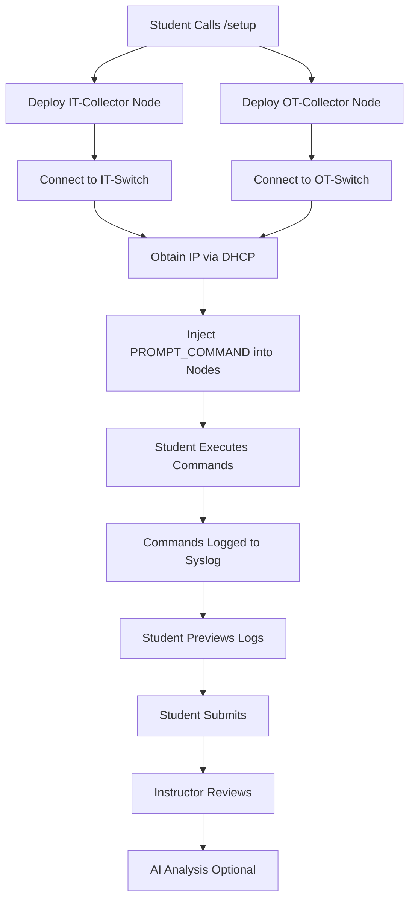

User: can you give me a detailed description of the entire project, and it's functionalities. I want to create a detailed report of the tool. try to include what you know about the backend to give a full understanding of this project.

Workspace: Collecting workspace information# AE³GIS - Agile Emulated Educational Environment for Guided Industrial Security Training

## Comprehensive Project Report

---

## 1. Executive Summary

AE³GIS is a comprehensive web-based platform designed for cybersecurity education in Industrial Control Systems (ICS) and IT/OT (Information Technology/Operational Technology) network environments. The system integrates with GNS3 (Graphical Network Simulator-3) to provide hands-on lab experiences for students learning about network security in industrial settings.

The platform serves two primary user roles:
- **Instructors**: Create, manage, and deploy network topologies and educational scenarios
- **Students**: Execute lab exercises, run scripts on network nodes, and submit work for grading

---

## 2. System Architecture

### 2.1 Technology Stack

**Frontend:**
- **Framework**: Next.js (React-based)
- **Language**: TypeScript
- **Styling**: Tailwind CSS with CSS variables for theming
- **Icons**: Lucide React
- **State Management**: React Context API (Settings, Theme providers)

**Backend:**
- **API Server**: Python FastAPI (based on API reference)
- **Integration**: GNS3 API for network simulation
- **AI Integration**: OpenAI API for log analysis
- **Storage**: File-based storage for topologies, scenarios, scripts, and submissions

**Environment Configuration:**
- `GNS3_URL`: Direct GNS3 server URL
- `AE3GIS_URL` / `BACKEND_URL`: Backend API URL
- `NEXT_PUBLIC_GNS3_IP`: Public GNS3 server IP

### 2.2 Architecture Diagram

```
┌─────────────────────────────────────────────────────────────────┐
│                        Frontend (Next.js)                        │
│  ┌─────────────┐  ┌─────────────┐  ┌─────────────────────────┐  │
│  │  Instructor │  │   Student   │  │    Shared Components    │  │
│  │   Pages     │  │   Pages     │  │  (Settings, Theme, etc) │  │
│  └─────────────┘  └─────────────┘  └─────────────────────────┘  │
│                              │                                   │
│                    ┌─────────▼─────────┐                        │
│                    │   API Routes      │                        │
│                    │  (/api/...)       │                        │
│                    └─────────┬─────────┘                        │
└──────────────────────────────┼──────────────────────────────────┘
                               │
                    ┌──────────▼──────────┐
                    │   Backend (FastAPI)  │
                    │   (AE3GIS API)       │
                    └──────────┬──────────┘
                               │
              ┌────────────────┼────────────────┐
              │                │                │
    ┌─────────▼─────┐  ┌───────▼───────┐  ┌────▼────┐
    │  GNS3 Server  │  │  File Storage │  │ OpenAI  │
    │  (VM-based)   │  │  (Topologies, │  │   API   │
    │               │  │   Scenarios)  │  │         │
    └───────────────┘  └───────────────┘  └─────────┘
```

---

## 3. Core Concepts

### 3.1 Topologies

A **Topology** represents a network infrastructure definition containing:
- **Nodes**: Virtual machines/containers representing network devices
- **Links**: Connections between nodes
- **Embedded Scripts**: Configuration scripts that run on nodes after deployment
- **Templates**: GNS3 template references for creating nodes

Topologies are the foundation that gets deployed to GNS3 projects.

### 3.2 Scenarios

A **Scenario** is a notebook-style educational document (similar to Jupyter Notebooks) containing:
- **Markdown Steps**: Text content for instructions, explanations, documentation
- **Script Steps**: Executable shell scripts that run on target nodes
- **Project Association**: Links to a GNS3 project for execution
- **Topology Reference**: Optional link to a recommended topology to deploy

### 3.3 Network Layers

The system organizes network nodes into logical layers:

| Layer | Purpose | Example Nodes |
|-------|---------|---------------|
| **IT** | Corporate/Enterprise network | Workstations, servers, DHCP, DNS |
| **DMZ** | Demilitarized zone | Firewalls, proxies, gateways, switches |
| **OT** | Operational Technology | PLCs, HMIs, SCADA, RTUs |
| **Field** | Field devices | Sensors, actuators, motors, valves |

---

## 4. User Roles and Functionality

### 4.1 Instructor Features

#### 4.1.1 Topology Management
- **Create Topologies**: Define network structures with nodes, links, and scripts via TopologyForm
- **Edit Topologies**: Modify existing topology definitions
- **Deploy Topologies**: Push topologies to GNS3 servers via DeployForm
- **Delete Topologies**: Remove stored topologies

#### 4.1.2 Scenario Management
- **Create Scenarios**: Build step-by-step lab exercises with markdown and scripts
- **Edit Scenarios**: Modify scenario content and steps via ScenarioEditor
- **Associate Topologies**: Link scenarios to recommended topologies
- **Execute Scripts**: Test scripts on running nodes

#### 4.1.3 Script Library
- **Create Scripts**: Store reusable scripts in the library via ScriptLibrary
- **Push Scripts**: Deploy scripts to multiple nodes via ScriptPushForm
- **Manage Scripts**: Edit, delete, and organize scripts

#### 4.1.4 Student Management
- **View Students**: List all students with active sessions
- **View Submissions**: Review student log submissions
- **AI Analysis**: Use OpenAI to analyze student command history
- **Reset Data**: Clear submissions and student sessions

### 4.2 Student Features

#### 4.2.1 Topology Viewing
- **Browse Topologies**: View available network topologies via StudentTopologiesPage
- **Deploy Topologies**: Deploy topologies to personal GNS3 server
- **View Details**: Examine nodes, links, and scripts

#### 4.2.2 Scenario Execution
- **Browse Scenarios**: Access available lab exercises via StudentScenariosPage
- **Execute Scripts**: Run script steps on target nodes
- **Modify Scripts**: Customize scripts before execution (changes not saved to backend)
- **Step-by-Step Progress**: Work through markdown and script steps

#### 4.2.3 Telemetry/Logging
- **Setup Logging**: Deploy syslog collectors to capture commands via StudentTelemetryPage
- **Preview Logs**: View collected command history before submission
- **Submit Logs**: Submit work for instructor grading

#### 4.2.4 Submissions
- **View History**: See past submissions via StudentSubmissionsPage
- **View Logs**: Review IT and OT logs from submissions

---

## 5. Key Components

### 5.1 Frontend Components

#### Layout Components
- RootLayout: Main application layout with theme and settings providers
- StudentLayout: Student-specific navigation
- InstructorLayout: Instructor-specific navigation

#### Form Components
- TopologyForm: Create/edit topologies with layer-based node organization
- ScenarioForm: Create/edit scenarios
- ScenarioEditor: Notebook-style scenario editing
- NodeForm: Configure individual nodes
- ScriptForm: Edit embedded scripts
- SettingsForm: Configure GNS3 connection settings

#### View Components
- TopologyDetailView: Display topology details
- ScenarioDetailView: Display scenario details
- ScenarioView: Read-only scenario display
- ScenarioList: List scenarios with actions

#### Step Components
- TextStep: Markdown content step
- ScriptStep: Executable script step

#### Deployment Components
- DeployForm: Deploy stored topologies
- AdHocDeployForm: Deploy modified topologies

### 5.2 Custom Hooks

| Hook | Purpose | File |
|------|---------|------|
| `useTopologies` | Fetch and manage topologies | useTopology.ts |
| `useScenarios` | Fetch and manage scenarios | useScenarios.ts |
| `useScripts` | Manage script library | useScripts.ts |
| `useTemplates` | Fetch GNS3 templates | useTemplates.ts |
| `useLogging` | Student logging operations | useLogging.ts |
| `useStudentManagement` | Instructor student management | useStudentManagement.ts |
| `useDeploy` | Deployment operations | useDeploy.ts |
| `useBuildScenario` | Build and deploy scenarios | useBuild.ts |
| `useSettings` | User settings context | SettingsContext.tsx |

### 5.3 API Routes

The frontend proxies requests to the backend through Next.js API routes:

#### Topology Routes
- `GET/POST /api/topologies` - List/create topologies
- `GET/PATCH/DELETE /api/topologies/[id]` - Single topology operations
- `POST /api/topologies/[id]/deploy` - Deploy stored topology
- `GET /api/topologies/projects/[projectName]/nodes` - List project nodes

#### Scenario Routes
- `GET/POST /api/scenarios` - List/create scenarios
- `GET/PATCH/DELETE /api/scenarios/[id]` - Single scenario operations
- `POST /api/scenarios/deploy` - Deploy ad-hoc topology
- `POST /api/scenarios/execute` - Execute scripts on nodes
- `DELETE /api/scenarios/projects/[projectId]/nodes` - Clear project nodes

#### Logging Routes
- `POST /api/logging/[studentName]/setup` - Setup logging
- `GET /api/logging/[studentName]/status` - Get logging status
- `GET /api/logging/[studentName]/preview` - Preview logs
- `POST /api/logging/[studentName]/submit` - Submit logs
- `DELETE /api/logging/[studentName]/teardown` - Teardown logging

#### Instructor Routes
- `GET /api/instructor/students` - List students
- `GET /api/instructor/submissions` - List submissions
- `GET /api/instructor/submissions/[studentName]/[submissionId]` - Get submission detail
- `POST /api/instructor/students/[studentName]/analyze` - AI analysis

#### GNS3 Routes
- `GET /api/gns3/projects` - List GNS3 projects
- `POST /api/gns3/build-scenario` - Build and deploy scenario
- `POST /api/gns3/save-topology` - Save topology
- `GET /api/gns3/get-topology` - Get topologies

---

## 6. Backend API Overview

Based on the API Reference, the backend provides:

### 6.1 Topology Endpoints

| Endpoint | Method | Description |
|----------|--------|-------------|
| `/topologies/` | POST | Create topology |
| `/topologies/` | GET | List topologies |
| `/topologies/{id}` | GET | Get topology detail |
| `/topologies/{id}` | PATCH | Update topology |
| `/topologies/{id}` | DELETE | Delete topology |
| `/topologies/{id}/deploy` | POST | Deploy stored topology |
| `/topologies/deploy` | POST | Deploy ad-hoc topology |
| `/topologies/projects/{name}/nodes` | GET | List project nodes by layer |
| `/topologies/projects/{id}/nodes` | DELETE | Delete all project nodes |

### 6.2 Scenario Endpoints

| Endpoint | Method | Description |
|----------|--------|-------------|
| `/scenarios/` | POST | Create scenario |
| `/scenarios/` | GET | List scenarios |
| `/scenarios/{id}` | GET | Get scenario detail |
| `/scenarios/{id}` | PATCH | Update scenario |
| `/scenarios/{id}` | DELETE | Delete scenario |
| `/scenarios/execute` | POST | Execute script on nodes |

### 6.3 Logging Endpoints

| Endpoint | Method | Description |
|----------|--------|-------------|
| `/logging/{student}/setup` | POST | Setup syslog collectors |
| `/logging/{student}/status` | GET | Get logging status |
| `/logging/{student}/preview` | GET | Preview collected logs |
| `/logging/{student}/submit` | POST | Submit logs for grading |
| `/logging/{student}/teardown` | DELETE | Remove collectors |

### 6.4 Instructor Endpoints

| Endpoint | Method | Description |
|----------|--------|-------------|
| `/instructor/students` | GET | List all students |
| `/instructor/submissions` | GET | List all submissions |
| `/instructor/submissions/{student}/{id}` | GET | Get submission detail |
| `/instructor/submissions/{student}/{id}` | DELETE | Delete submission |
| `/instructor/students/{student}/analyze` | POST | AI log analysis |
| `/instructor/reset/all` | DELETE | Reset all data |

---

## 7. Data Models

### 7.1 Topology Types

From topology.ts:

```typescript
// Node in a topology
type TopologyNode = {
  name: string;
  template_id?: string;
  template_key?: string;
  template_name?: string;
  x: number;
  y: number;
  layer?: "IT" | "DMZ" | "OT" | "Field";
  scripts?: EmbeddedScript[];
};

// Embedded script in a node
type EmbeddedScript = {
  name: string;
  content: string;
  remote_path?: string;
  priority?: number;
  shell?: string;
  timeout?: number;
};

// Complete topology definition
type TopologyDefinition = {
  gns3_server_ip?: string;
  project_name?: string;
  project_id?: string;
  templates?: Record<string, string>;
  nodes: TopologyNode[];
  links: TopologyLink[];
};
```

### 7.2 Scenario Types

From scenario.ts:

```typescript
// Markdown step
interface MarkdownStep {
  type: "markdown";
  title?: string;
  content: string;
}

// Script step
interface ScriptStep {
  type: "script";
  title?: string;
  script_name: string;
  script_content: string;
  storage_path?: string;
  target_nodes?: string[];
  run_after_upload?: boolean;
  timeout?: number;
  description?: string;
}

// Complete scenario
interface Scenario {
  id: string;
  name: string;
  description?: string;
  project_name?: string;
  default_topology_id?: string;
  steps: (MarkdownStep | ScriptStep)[];
  created_at: string;
  updated_at: string;
}
```

### 7.3 Settings

From SettingsContext.tsx:

```typescript
interface Settings {
  gns3ServerIp: string;
  gns3ServerPort: number;
  gns3Username: string;
  gns3Password: string;
  defaultProjectName: string;
  defaultScriptPath: string;
  priorityDelay: number;
  studentName: string;
  isConfigured: boolean;
}
```

---

## 8. Key Workflows

### 8.1 Instructor: Creating a Lab



### 8.2 Student: Completing a Lab



### 8.3 Logging System Flow



---

## 9. Security Considerations

### 9.1 Current State (Demo Mode)
- **No Authentication**: The system operates without user authentication
- **Role-Based Access**: Soft enforcement through separate routes
- **GNS3 Credentials**: Stored in browser localStorage

### 9.2 Recommendations for Production
- Implement user authentication (OAuth, LDAP integration)
- Add role-based access control (RBAC)
- Secure GNS3 credentials handling
- Enable HTTPS for all communications
- Add rate limiting for API endpoints
- Implement audit logging

---

## 10. Deployment Requirements

### 10.1 Prerequisites
- Node.js 18+ for frontend
- Python 3.9+ for backend
- GNS3 VM with network templates loaded
- Docker templates for network devices
- OpenAI API key (optional, for AI analysis)

### 10.2 Environment Variables

**Frontend (.env.local)**:
```env
GNS3_URL=http://{GNS3_IP}:{PORT}/v2
AE3GIS_URL=http://{BACKEND_IP}:{PORT}
NEXT_PUBLIC_GNS3_IP={GNS3_IP}
```

**Backend**:
```env
GNS3_SERVER_IP=192.168.56.101
GNS3_SERVER_PORT=80
GNS3_SERVER_USER=gns3
GNS3_SERVER_PASSWORD=gns3
OPENAI_API_KEY=sk-...  # Optional
```

---

## 11. Network Device Configuration

### 11.1 Default IT Devices

From deviceConfig.tsx:

| Device | Default Count | Description |
|--------|---------------|-------------|
| Computers | 3 | End-user computers |
| Switches | 2 | Network switches |
| DHCP_Server | 1 | Dynamic IP assignment |
| Web_Server | 1 | HTTP/HTTPS services |
| DNS_Server | 1 | Domain name resolution |

### 11.2 Default OT Devices

| Device | Description |
|--------|-------------|
| PLCs | Programmable Logic Controllers |
| HMIs | Human-Machine Interfaces |
| SCADA | Supervisory Control systems |
| RTUs | Remote Terminal Units |

---

## 12. AI Integration

### 12.1 Log Analysis Feature

The system integrates with OpenAI to provide automated analysis of student command logs:

- **Purpose**: Help instructors quickly assess student work
- **Input**: IT and OT logs from student submissions
- **Output**: AI-generated summary including:
  - Key actions performed
  - Observations about methodology
  - Recommendations for improvement

### 12.2 Configuration

```env
OPENAI_API_KEY=sk-...
OPENAI_MODEL=gpt-4o  # Optional, defaults to gpt-4o
```

---

## 13. Testing and Development

### 13.1 Test Page

The test page provides:
- Script deployment testing
- Node selection from active scenarios
- Direct script execution
- Result verification

### 13.2 Running Development Server

```bash
# Install dependencies
npm install

# Run development server
npm run dev

# Build for production
npm run build
```

---

## 14. Future Enhancements

Based on the codebase structure, potential enhancements include:

1. **Real-time Collaboration**: Multiple users editing scenarios simultaneously
2. **Progress Tracking**: Student progress through scenario steps
3. **Automated Grading**: AI-based automated assessment of student work
4. **Template Marketplace**: Shareable topology and scenario templates
5. **Multi-GNS3 Server Support**: Load balancing across multiple GNS3 instances
6. **Version Control**: Git-like versioning for topologies and scenarios
7. **Export/Import**: Portable scenario packages

---

## 15. Conclusion

AE³GIS provides a comprehensive platform for cybersecurity education in industrial network environments. By integrating with GNS3 for network simulation and providing a structured approach to lab exercises through topologies and scenarios, the system enables:

- **Instructors**: To create rich, interactive lab experiences
- **Students**: To learn hands-on skills in a safe, simulated environment
- **Assessment**: Through logged command history and AI-assisted analysis

The modular architecture, with clear separation between frontend and backend, allows for scalability and future enhancements while maintaining a clean, maintainable codebase.